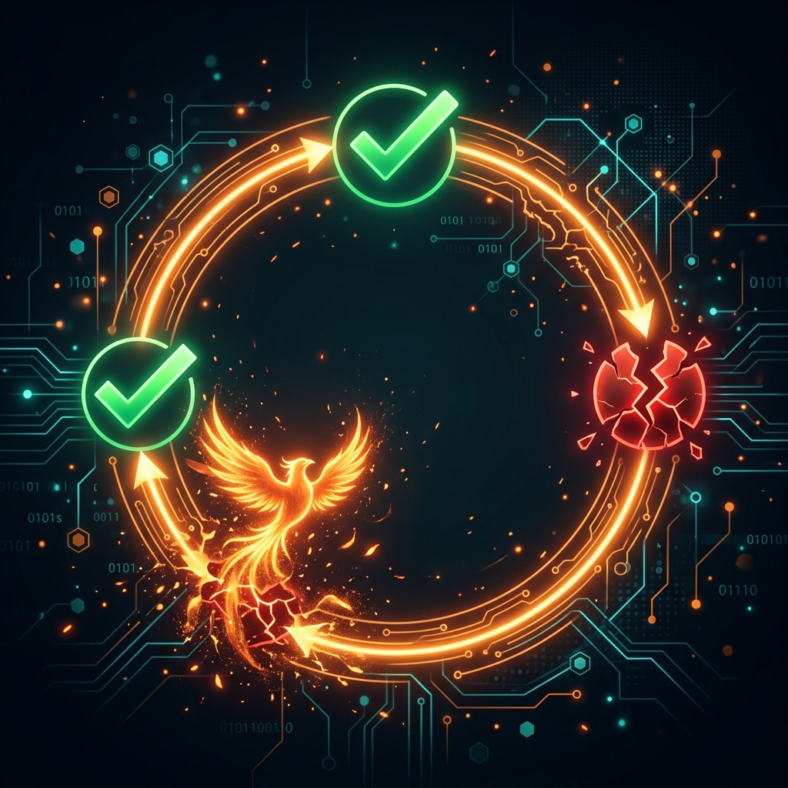

# ATV-Phoenix


**A self-healing harness for AI coding agents.** Phoenix gives GitHub Copilot (and Microsoft Scout)
the one organ they're missing: the ability to **objectively sense when a task actually failed, and
heal it** — instead of declaring "done" on silently-broken work.

> _Rises from its own ashes. Senses when it's broken, heals itself, gets better with use._

---

## The results that justify it

Three hypotheses, all tested on **live GitHub Copilot sessions**, scored by hidden checkers (ground truth):

| Question | Result |
|---|---|
| **Does objective verification beat self-judgment?** (H2) | Silent-failure rate **40% → 0%** across 20 sessions — vanilla Copilot shipped broken code with false confidence on tasks with hidden acceptance criteria; Phoenix caught and healed every one. **Zero regressions.** |
| **Does formalizing intent into a check first help?** (H1) | **+0.125** mean verified-outcome lift, **replicated 3/3 runs** (criteria-first perfect every run). |
| **Does injecting the right context/memory help?** (H3) | **0% → 100%** — without a project's convention, Copilot produced a plausible-but-wrong default every time; with it injected, correct every time. |

Together: **formalize intent + verify objectively + supply the right context.** Full method + raw data
per experiment under [`evals/`](evals/).

---

## What Phoenix gives the agent (4 tools)



| Tool | What it does |
|---|---|
| `phoenix_sense` | Objectively check success — a command's exit code, a file hash, or a regex. **No self-grading.** |
| `phoenix_snapshot` | Save a known-good state — but **only if a check passes** (never blesses broken state). |
| `phoenix_heal` | Bounded recovery (rollback to a snapshot, or retry ≤3×), **confirmed by an external recheck**. |
| `phoenix_verify_trace` | Audit a tamper-evident, hash-chained trace of everything sensed and healed. |

The loop: **baseline-green → snapshot → edit → sense → heal if red → confirm green** — all on
*objective* signals, all traced.

---

## Install

### GitHub Copilot CLI (recommended)
```powershell
git clone https://github.com/All-The-Vibes/ATV-Phoenix
cd ATV-Phoenix
python .copilot-plugin/skills/phoenix-setup/setup.py --repo .
```
The setup script is idempotent: it builds the Rust binary if needed, registers the `phoenix` MCP
server in `~/.copilot/mcp-config.json`, and installs the `phoenix` agent. Restart Copilot, then ask it
to verify + heal a task — it calls the tools automatically. (Requires [Rust](https://rustup.rs) +
Python. `dist/install.ps1` is a PowerShell equivalent.)

### Microsoft Scout (CLI adapter)
Scout doesn't take external MCP servers, so Phoenix ships a **CLI** the Scout agent calls via its
shell tool, plus a Scout skill that teaches the verify-heal loop:
```powershell
phoenix-mcp sense   '{"kind":"command_exit","target":["pytest","-q"],"expect":0}'   # exit 0 = pass
phoenix-mcp snapshot src/app.py '{"kind":"command_exit","target":["pytest","-q"]}'
phoenix-mcp heal    rollback '{"path":"src/app.py","snap_id":"...","recheck":{...}}'
phoenix-mcp verify-trace
```
See [`dist/scout/`](dist/scout/). Same Rust binary, both hosts.

---

## Why it works (the thesis)

**The orchestration layer — not the model — determines agent success.** Most "the model failed"
problems are *harness* failures: no objective completion signal, no recovery, no evidence. Phoenix is
the missing layer. Two design principles it proves:

- **Enforce, don't offer.** In the experiment, unprompted Copilot self-verified **0/10** times. Value
  comes from the harness *enforcing* the verify-heal loop, not from a tool merely being available.
- **Evidence over self-grading.** `phoenix_sense` only reports objective signals; "I'm not sure it
  passed" is allowed, a fabricated "done!" is the failure mode Phoenix exists to prevent.

Phoenix builds only the novel spine — **objective sensing, bounded healing, measured improvement** —
and composes with proven companions rather than reinventing them (see the stack below).

## The recommended stack (Phoenix composes, it doesn't reinvent)

Phoenix is standards-native ([agentskills.io](https://agentskills.io) skills + MCP), so it stacks with
best-in-class companion plugins. `setup.py` detects what's installed and prints the install commands for
the rest.

| Layer | Component | Ships with Phoenix? |
|---|---|---|
| **Self-heal + full lifecycle** (the core) | A comprehensive 10-skill pack: `phoenix` (router) + `phoenix-think/plan/build/test/debug/context/review/ship` + `phoenix-self-heal` — every stage gated by an objective `phoenix_sense` check + the `phoenix` MCP server / CLI | **Bundled** (`skills/`, installed automatically) |
| **Token-efficient retrieval** | [TokenMasterX](https://github.com/shyamsridhar123/TokenMasterX) — graph-routed code navigation (−73% tokens) | **Bundled** (`vendor/token-master`, installed automatically; needs `graphify`) |
| **Extra lifecycle skills** | [Addy Osmani's agent-skills](https://github.com/addyosmani/agent-skills) — MIT general workflow pack | Optional companion (`agent-skills@addy-agent-skills`) |

`setup.py` installs the whole stack in one command: the **10-skill verification-gated lifecycle pack**
(a meta-router + think → plan → build → test → debug → context → review → ship + self-heal), the self-heal
MCP server, **and the bundled TokenMasterX** (vendored MIT, `graphify`-backed). Every lifecycle stage is
gated by an objective `phoenix_sense` check, every skill carries a *Common Rationalizations* table and
*Red Flags* section (the discipline that stops the model talking itself out of verification), and the
whole pack is **token-efficient by design** — structural questions route to the code graph, detail loads
only on activation. The pack is **self-maintaining**: `phoenix-mcp doctor` validates every bundled skill
with Phoenix's own spine, and `cargo test` fails if any skill drifts — the harness verifies itself.

---

## Status (v0.1.0)

Every milestone has a measured eval + a screenshot.

| Milestone | Proven | Evidence |
|---|---|---|
| M0 | token/retrieval pillar (TokenMasterX/graphify) validated | [result](evals/m0-install-path/RESULT.md) · [shot](evals/screenshots/m0-graph-viz.png) |
| M1 | self-healing spine in Rust (`cargo test`) | [result](evals/m1-self-heal/RESULT.md) · [shot](evals/screenshots/m1-self-heal.png) |
| M2 | works over real MCP protocol | [result](evals/m2-mcp/RESULT.md) · [shot](evals/screenshots/m2-mcp-session.png) |
| M3 | heals a fault **live inside Copilot** | [result](evals/m3-live-copilot/RESULT.md) · [shot](evals/screenshots/m3-live-copilot.png) |
| H1 | criteria-first lift +0.125, replicated 3/3 | (goose I2O scorecard) |
| H2 | silent failures **40%→0%** | [result](evals/h2-experiment/RESULT.md) · [shot](evals/screenshots/h2-results.png) |
| H3 | context/memory lift **0%→100%** | [result](evals/h3-experiment/RESULT.md) · [shot](evals/screenshots/h3-results.png) |

**Honest limits:** results are directional (small n, single model, deterministic checkers). Recovery is
"bounded objective recovery," not broad self-healing. Command timeouts aren't yet enforced in-process.
`copilot plugin install <repo>` (marketplace path) is scaffolded but not yet verified end-to-end —
install via `setup.py` today. See [`BUILDLOG.md`](BUILDLOG.md) for the full honest engineering record —
every bug, reversal, and dead end (including a dogfooding fix that cut a real run from 72 credits to 15).

## License
MIT — see [LICENSE](LICENSE). Phoenix bundles its own `phoenix-self-heal` skill (MIT) and composes
with separately-installed MIT/open companions ([TokenMasterX](https://github.com/shyamsridhar123/TokenMasterX),
[Addy Osmani's agent-skills](https://github.com/addyosmani/agent-skills)) by recommendation, not by vendoring.
