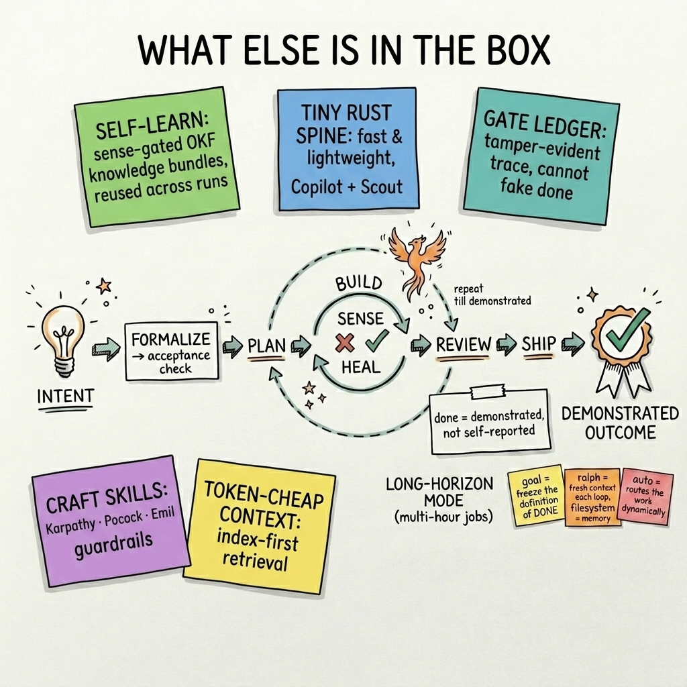

# ATV-Phoenix


**The self-healing, self-learning harness for intent engineering.** A million harnesses scaffold
code generation. Phoenix is built for a different unit of work — **intent → outcome**: you formalize
what you actually want into an objective, runnable check, and Phoenix drives the agent to a *demonstrated*
outcome against it — sensing failure, healing itself, and carrying forward what it learns.

Fast and lightweight by design — a tiny **Rust spine**, no heavyweight runtime — wrapping GitHub
Copilot and Microsoft Scout. Three moves, all on *objective* signals, never the model's self-grade:

- **Formalize** intent into a runnable acceptance check *before* writing code.
- **Self-heal** — sense when the work actually failed and recover (rollback / bounded retry), confirmed
  by an external recheck.
- **Self-learn** — durable knowledge lives in **[Open Knowledge Format](https://github.com/GoogleCloudPlatform/knowledge-catalog/tree/main/okf)**
  bundles: markdown + frontmatter, graph-shaped, **git-diffable**, and **sense-gated for conformance**
  (learned knowledge passes an objective check before it's trusted). The agent **produces, validates,
  and re-consumes** them **index-first as token-cheap context** — so what's learned is carried across
  runs, not just within one. Completion itself is *demonstrated* from a tamper-evident trace (a check went
  red → green), never self-reported.

The measured payoff on live GitHub Copilot sessions: silent failures **40% → 0%**, zero regressions.

> 🪿 **Built entirely by Goose** — an autonomous AI agent on Microsoft Scout. No human wrote code in
> this repo. The thesis it sets out to prove: **the harness, not the model, is what makes an agent
> reliable.** Everything below is the evidence.

---

## One line in. A demonstrated outcome out.



Point Phoenix at a one-line idea and walk away. It **interviews** you into a crystal intent, **formalizes**
it into a runnable acceptance check, then runs the full **think → plan → build → test → review → ship**
lifecycle on autopilot — **healing every failure** and **re-checking its own work** at every step.

For **long-horizon work** — multi-hour, many-step jobs — Phoenix's autonomous trio takes over:
[`phoenix-goal`](skills/phoenix-goal/SKILL.md) sets a persistent definition of done,
[`phoenix-ralph`](skills/phoenix-ralph/SKILL.md) grinds the backlog across fresh-context iterations
(filesystem as memory), and [`phoenix-auto`](skills/phoenix-auto/SKILL.md) routes dynamically. It's the
same long-running-agent design **OpenAI Codex** (`/goal` mode) and **Anthropic** (a goal condition
re-checked every turn) converge on — but their loops still end in an *opinion* (an LLM grading output, a
diff for you to review). **Phoenix ends in evidence:** it doesn't stop when the model *says* it's done —
it stops when a **tamper-evident trace *proves*** the acceptance check went red → green, or it doesn't
ship. That's the property you actually need before you walk away from an unattended loop.

The difference, measured: silent failures **40% → 0%**, zero regressions, completion you can audit.

**→ Full greenfield walkthrough: [`docs/developer-journey.md`](docs/developer-journey.md) · long-horizon design + lab alignment: [`docs/autonomous-workflows.md`](docs/autonomous-workflows.md)**

---

## The results that justify it

Three hypotheses, all tested on **live GitHub Copilot sessions**, scored by hidden checkers (ground truth):

| Question | Result |
|---|---|
| **Does objective verification beat self-judgment?** (H2) | Silent-failure rate **40% → 0%** across 20 sessions — vanilla Copilot shipped broken code with false confidence; Phoenix caught and healed every one. **Zero regressions.** |
| **Does formalizing intent into a check first help?** (H1) | **+0.125** mean verified-outcome lift, **replicated 3/3 runs** (criteria-first perfect every run). |
| **Does injecting the right context/memory help?** (H3) | **0% → 100%** — without a project's convention, Copilot produced a plausible-but-wrong default every time; with it injected, correct every time. |
| **Does it hold up on a SWE-bench-style contract?** | Underspecified resolved-rate **50% → 100%** (overall **78% → 100%**, **0 regressions**) — both vanilla misses were *silent failures* the enforced test-gate caught. |

And it isn't just fault-recovery on broken files — under the loop, live Copilot **built a real project
end-to-end** (a working Space Invaders game) gated by an objective check + a hardened Playwright
interaction gate. Full method + raw data per experiment under [`evals/`](evals/).

---

## What Phoenix gives the agent (5 tools)

| Tool | What it does |
|---|---|
| `phoenix_sense` | Objectively check success — a command's exit code, a file hash, or a regex. **No self-grading.** |
| `phoenix_snapshot` | Save a known-good state — but **only if a check passes** (never blesses broken state). |
| `phoenix_heal` | Bounded recovery (rollback to a snapshot, or retry ≤3×), **confirmed by an external recheck**. |
| `phoenix_verify_trace` | Audit a tamper-evident, hash-chained trace of everything sensed and healed. |
| `phoenix_accept` | **The gate ledger** — returns ok only if the trace proves a check went **red→green** (failure-first) and is green now. |

The loop: **baseline-green → snapshot → edit → sense → heal if red → confirm green** — all on
*objective* signals, all traced.

---

## Install

### GitHub Copilot CLI (recommended)
```powershell
git clone https://github.com/All-The-Vibes/ATV-Phoenix
cd ATV-Phoenix
python .copilot-plugin/skills/phoenix-setup/setup.py --repo .
```
The setup script is idempotent: it builds the Rust binary if needed, registers the `phoenix` MCP
server in `~/.copilot/mcp-config.json`, and installs the `phoenix` agent. Restart Copilot, then ask it
to verify + heal a task. (Requires [Rust](https://rustup.rs) + Python. `dist/install.ps1` is a
PowerShell equivalent.)

### Microsoft Scout (CLI adapter)
Scout doesn't take external MCP servers, so Phoenix ships a **CLI** the Scout agent calls via its
shell tool, plus a Scout skill that teaches the verify-heal loop:
```powershell
phoenix-mcp sense   '{"kind":"command_exit","target":["pytest","-q"],"expect":0}'   # exit 0 = pass
phoenix-mcp snapshot src/app.py '{"kind":"command_exit","target":["pytest","-q"]}'
phoenix-mcp heal    rollback '{"path":"src/app.py","snap_id":"...","recheck":{...}}'
phoenix-mcp verify-trace
```
See [`dist/scout/`](dist/scout/). Same Rust binary, both hosts.

### Using it (after install)
Phoenix is a **harness, not a background daemon** — it doesn't watch your repo or act on its own. It
shapes how Copilot works *while you work*, and you stay in the driver's seat.

- **Automatic:** just work normally. Ask Copilot to build, fix, or ship something and the matching
  Phoenix skill engages by itself — running an objective check, healing failures, and refusing to call a
  task "done" until a check actually goes **red → green**.
- **To be sure it's engaged:** start a task with **`/phoenix`** (loads the router + the laws), or select
  the installed **`phoenix` agent**.
- **Hands-off / autonomous:** say **"go"** or **`/phoenix-goal "<your goal>"`** — it FORMALIZES an
  objective done-check first, then runs the whole lifecycle to completion (see
  [autonomous workflows](docs/autonomous-workflows.md)).

Quick smoke test: ask it to fix a failing test and watch it **sense → heal → confirm green**.

---

## Open knowledge (OKF)

Phoenix implements the [Open Knowledge Format](https://github.com/GoogleCloudPlatform/knowledge-catalog/tree/main/okf)
(OKF v0.1) — a directory of markdown + YAML frontmatter, graph-shaped via links, with `index.md` for
progressive disclosure. The `phoenix-okf` skill closes the full loop:

- **Produce** — export the code graph to a browsable, git-diffable OKF bundle (one concept per source file).
- **Validate / sense** — §9 conformance is a `phoenix_sense` gate; bundles are sensed through the spine.
- **Consume** — ingest any OKF bundle index-first as token-cheap context (`okf_ingest`).
- **Interop** — ingest *foreign* bundles authored by other tools; broken-link-tolerant under `--strict-links`.

**See it run:** [`demo/okf/run-demo.ps1`](demo/okf/run-demo.ps1) is a narrated 5-beat community demo with a
real red→green heal. Token receipts in [`evals/m4-okf/`](evals/m4-okf/RESULT.md) and
[`evals/m5-okf-live/`](evals/m5-okf-live/RESULT.md).

---

## What's in the box

- **18 verification-gated skills** — a meta-router, the `think → ship` lifecycle, craft skills
  (Karpathy / Pocock / Emil), the self-heal + OKF spine, a `doctor` that verifies and repairs the install
  itself, and the autonomous `goal`/`ralph`/`auto` trio. Every stage gates on an objective `phoenix_sense`
  check. Full catalog: **[`docs/skills.md`](docs/skills.md)**.
- **TokenMasterX** (bundled, MIT) — graph-routed code navigation, **−73% tokens**; `phoenix-context`
  routes structural questions here instead of grepping whole directories.
- **One-command install** — `setup.py` installs the whole stack; nothing else to fetch.
- **The long-horizon engine** — for multi-hour, many-step jobs, the autonomous trio
  [`phoenix-goal`](skills/phoenix-goal/SKILL.md) + [`phoenix-ralph`](skills/phoenix-ralph/SKILL.md) +
  [`phoenix-auto`](skills/phoenix-auto/SKILL.md) runs the whole lifecycle to completion unattended,
  stopping only on a trace-demonstrated outcome. The same long-running-agent design as OpenAI Codex / Anthropic
  — but completion is *demonstrated*, not judged. See the [developer journey](docs/developer-journey.md) and
  [autonomous workflows](docs/autonomous-workflows.md).

**Why it works:** the orchestration layer — not the model — determines agent success. Most "the model
failed" problems are *harness* failures: no objective completion signal, no recovery, no evidence.
Two principles Phoenix proves: **enforce, don't offer** (unprompted Copilot self-verified 0/10 times),
and **evidence over self-grading** (a fabricated "done!" is the failure mode Phoenix exists to kill).
The bigger bet — Intent-to-Outcome — is in **[`docs/intent-to-outcome.md`](docs/intent-to-outcome.md)**.

---

## Status (v0.3.0)

Every milestone has a measured eval + a screenshot.

| Milestone | Demonstrated | Evidence |
|---|---|---|
| M0 | token/retrieval pillar (TokenMasterX/graphify) validated | [result](evals/m0-install-path/RESULT.md) · [shot](evals/screenshots/m0-graph-viz.png) |
| M1 | self-healing spine in Rust (`cargo test`) | [result](evals/m1-self-heal/RESULT.md) · [shot](evals/screenshots/m1-self-heal.png) |
| M2 | works over real MCP protocol | [result](evals/m2-mcp/RESULT.md) · [shot](evals/screenshots/m2-mcp-session.png) |
| M3 | heals a fault **live inside Copilot** | [result](evals/m3-live-copilot/RESULT.md) · [shot](evals/screenshots/m3-live-copilot.png) |
| E2E | builds a **real project end-to-end** live in Copilot — Space Invaders, gated by an objective check + a **hardened Playwright interaction gate** | [result](evals/e2e-sandbox/RESULT.md) · [shot](evals/screenshots/e2e-space-invaders.png) |
| Autonomy | **gate ledger** (failure-first, trace-derived completion) + Ralph loop driver | [result](evals/autonomous-workflows/RESULT.md) · [shot](evals/screenshots/autonomous-workflows.png) |
| OKF | produce / validate / sense / consume / interop, 12 pytest + 3 Rust spine tests, CI | [result](evals/m4-okf/RESULT.md) · [live](evals/m5-okf-live/RESULT.md) |
| H1 | criteria-first lift +0.125 mean, replicated 3/3 | [method + backlog](docs/intent-to-outcome.md#5-the-research-backlog-falsifiable-hypotheses) |
| H2 | silent failures **40%→0%** | [result](evals/h2-experiment/RESULT.md) · [shot](evals/screenshots/h2-results.png) |
| H3 | context/memory lift **0%→100%** | [result](evals/h3-experiment/RESULT.md) · [shot](evals/screenshots/h3-results.png) |
| SWE-bench-lite | resolved-rate, underspecified tier **50%→100%** (overall 78%→100%, **0 regressions**) | [result](evals/swe-bench-lite/RESULT.md) · [shot](evals/screenshots/swe-bench-result.png) |

**Honest limits:** results are directional (small n, single model, deterministic checkers). Recovery is
"bounded objective recovery," not broad self-healing. Command timeouts aren't yet enforced in-process.
`copilot plugin install <repo>` (marketplace path) is scaffolded but not yet verified end-to-end —
install via `setup.py` today. See [`BUILDLOG.md`](BUILDLOG.md) for the full honest engineering record.

## License
MIT — see [LICENSE](LICENSE). Phoenix bundles its **16-skill verification-gated pack** (MIT) and
**vendors TokenMasterX** (MIT © 2026 Shyam Sridhar) under [`vendor/token-master`](vendor/token-master),
both installed automatically. Every skill is original, written from scratch for Phoenix.
