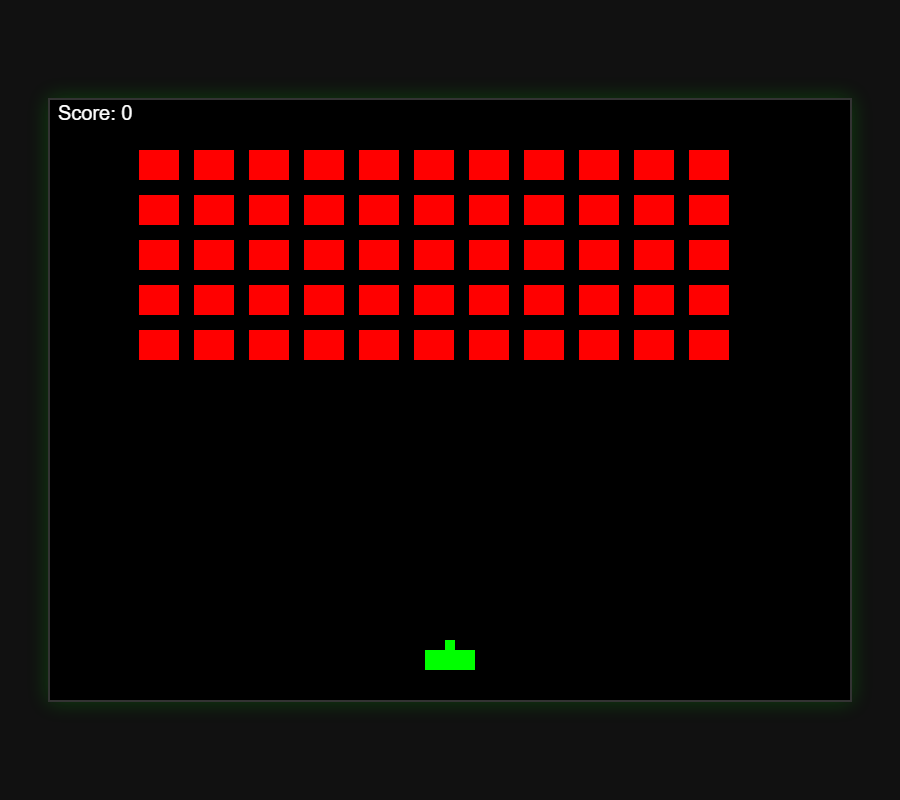

# E2E — fresh clone → install → real build (Space Invaders) in an isolated sandbox

**Date:** 2026-06-10
**Goal:** Prove the *whole product* works end-to-end for a stranger: clone the repo, install in one
command, and have GitHub Copilot build + objectively verify a real project through the Phoenix loop.
**Verdict:** ✅ PASS — fresh clone built green (6/6 tests), installed clean into an isolated HOME
(13/13 skills, doctor OK), and live Copilot built a working Space Invaders game gated by an objective
check, then verified it — proven by the running game's screenshot.

---

## The flow (every step real, in an isolated sandbox)

1. **Fresh clone** — `git clone https://github.com/All-The-Vibes/ATV-Phoenix` (from the remote, clean).
   → 13 skills + vendored TokenMasterX present in the clone.
2. **Cold build + test** — `cargo build --release` (110s) → binary; `cargo test` → **6/6 suites pass**
   (the shipped repo is self-contained and green).
3. **Isolated install** — `python setup.py` into a **fake HOME** (real `~/.copilot` untouched):
   registered the MCP server + `phoenix` agent, installed **13 bundled skills**, and the post-install
   **`phoenix-mcp doctor` self-check reported 13/13 OK**.
4. **Real E2E build** — task: *build a complete Space Invaders HTML game from scratch.* Objective gate:
   `node check.js` (validates canvas, game loop, player, invaders, bullets, collision, keyboard, score,
   non-trivial size) — hidden from the agent. Live GitHub Copilot, driven through the Phoenix verify-heal
   loop, wrote `game.html` (254 lines / 8164 bytes), then:
   - `phoenix_sense` (`node check.js`) → **ok: true** (all 9 mechanics present)
   - `phoenix_verify_trace` → **ok: true** (hash `1923e024…`)
   - independent re-check `node check.js` → **exit 0, OK: all 9 mechanics present**
   - cost: 23.6 credits / 1m10s.
5. **Proof it's real** — the game renders and runs: 5 rows of invaders, player ship, score, dark arcade
   aesthetic. See screenshot.

## Screenshot evidence

*The game GitHub Copilot built from scratch under the Phoenix loop, gated by an objective check — running.*

## Artifacts
- `space-invaders-game.html` — the game Copilot produced (committed as the E2E artifact).
- `game-check.js` — the objective acceptance gate (`node check.js`, exit 0 = pass).

## What this proves (beyond the toy tests)
- The **install is real and portable**: a clean clone builds, tests green, and installs into a fresh
  HOME with no manual steps and a passing self-check.
- The **product works on a real build**, not a contrived broken file: Copilot built a non-trivial,
  actually-running game, and Phoenix's objective gate confirmed it — no self-grading.
- The **whole stack composes**: bundled skills + MCP spine + objective check, exercised together, live.

## Honest limits
- The check is structural (mechanics present + size), not a full playthrough — it proves the game has the
  required parts and runs, not that every interaction is bug-free. A deeper gate would add an interaction
  test (e.g. Playwright key-press → score increments).
- Single build, single model. A clear demonstration, not a statistical claim.
